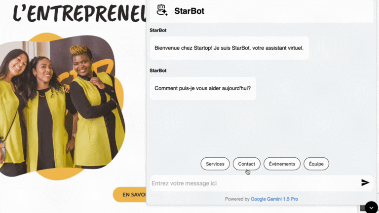

# StarBot Chatbot Widget

## Overview

`ChatBotSimpleApi` is a React-based chatbot widget that uses the Gemini 1.5 API from Google Generative Language to interact with users. The chatbot fetches information from a JSON file (`description-eng.json`) and provides concise responses about Startop's events, services, and other relevant details.

## Features

- **Interactive Chat Interface:** Allows users to send messages and receive responses from the chatbot.
- **AI-Powered Responses:** Supports both free-text inputs and predefined message buttons.
- **Conversation History:** Enhances user experience by making interactions feel more personalized and coherent.
- **Scroll-to-Bottom Button:** A button to quickly scroll to the latest message.
- **Resizable Chat Window:** Users can resize the chat window using the resize handle.
- **Markdown Rendering:** Supports rendering messages with Markdown.
- **Minimize Button:** A round button to minimize the chat widget, placed at the bottom of the chat window.
- **Predefined Message Buttons:** Gemini processes these inputs to provide accurate and helpful answers.
- **Follow-Up Buttons:** After an initial response, follow-up buttons offer related queries to guide users through more detailed interactions.


## Prerequisites

- **Node.js:** Ensure Node.js is installed on your system.
- **API Key:** Obtain an API key from Google Generative Language.

## Installation

1. **Clone the Repository:**

   ```sh
   git clone https://github.com/Sharipat/Startop-Chatbot-Project.git
   ```

2. **Install Dependencies:**

   ```sh
   npm install
   ```

3. **Set Up Environment Variables:**

   Create a `.env` file in the root directory and add your API key:

   ```env
   NEXT_PUBLIC_API_KEY=your-api-key
   ```

4. **Start the Development Server:**

   ```sh
   npm run dev
   ```

5. **Access the Application:**

   Open your browser and navigate to `http://localhost:3000`.

## Usage

### ChatBotSimpleApi Component

The `ChatBotSimpleApi` component is the main chatbot interface. It handles fetching the description data, sending messages to the API, and rendering the chat interface.

### Key Files

- `index.tsx`: Main React components for the chatbot.
- `description-eng.json`: JSON file containing the description data for Startop.

## Configuration

### JSON Data File

The `description-eng.json` file should contain the following structure:

```json
{
  "examples": [],
  "à propos": {
    "mission": "Mission statement",
    "vision": "Vision statement",
    "valeurs_fondamental": "Core values",
    "chronologie": "Timeline",
    "team": "Team information"
  },
  "services": {
    "coaching": "Coaching details",
    "programme_pivot_économie": "Program details",
    "aide_à_la_gouvernance": "Governance help",
    "rédaction_du_plan_d_affaires": "Business plan writing",
    "adhésion": "Membership details"
  },
  "publications": "Publications details",
  "events": {
    "2023": "Events in 2023",
    "2024": "Events in 2024"
  },
  "contacts": {
    "phone_number": "Phone number",
    "address": "Address",
    "website": "Website URL",
    "socials": {
      "facebook": "Facebook URL",
      "instagram": "Instagram URL",
      "linkedin": "LinkedIn URL",
      "youtube": "YouTube URL"
    }
  }
}
```

## User Interaction Example

**Example Questions:**
- "Quelle était la date du dernier évènement Startop?"
- "Quels sont les sujets traités dans les publications de Cindy Tinh?"
- "Quel est le processus pour s'inscrire au programme Pivot en économie sociale?"
- "Dis-moi un truc aléatoire sur Startop"

**Example of Usage:**



## Customization

### Styles

You can customize the styles by modifying the `styles` object in `ChatBotSimpleApi.tsx`. For example, to change the background color of the chat container, update the `container` style:

```tsx
const styles: { [key: string]: React.CSSProperties } = {
  container: {
    // ... other styles
    backgroundColor: "#ffffff",
    // ... other styles
  },
  // ... other styles
};
```

### Initial State

The chat widget starts in a minimized state by default. To change this behavior, modify the initial state of `isMinimized`:

```tsx
const [isMinimized, setIsMinimized] = useState<boolean>(true);
```

### Adding Features

You can add new features or modify existing ones by updating the component logic in `ChatBotSimpleApi`. For example, to add new buttons or change the layout, update the JSX structure within the `return` statement.


## License

This project is licensed under the MIT License. 

## Acknowledgements

- [Google Generative Language API](https://cloud.google.com/generative-language)
- [React](https://reactjs.org/)
- [date-fns-tz](https://github.com/marnusw/date-fns-tz)
- [marked](https://marked.js.org/)
